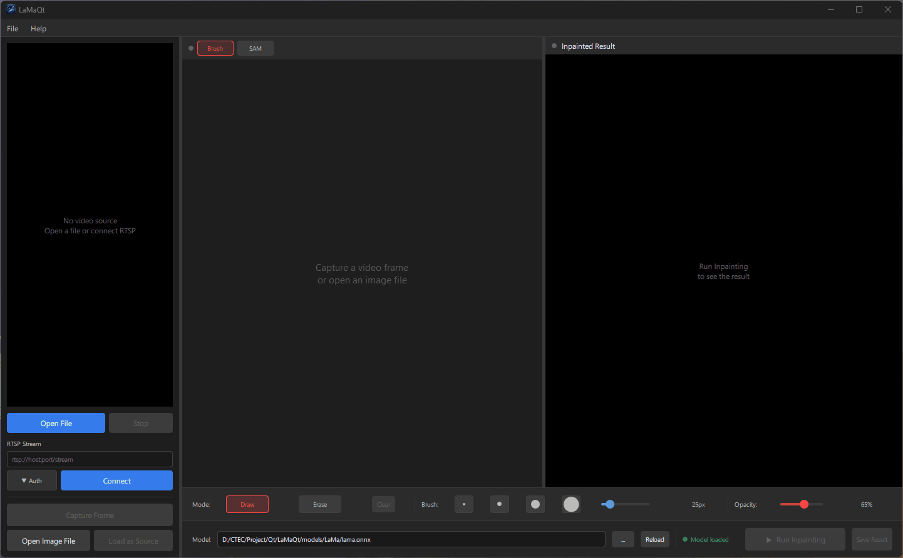
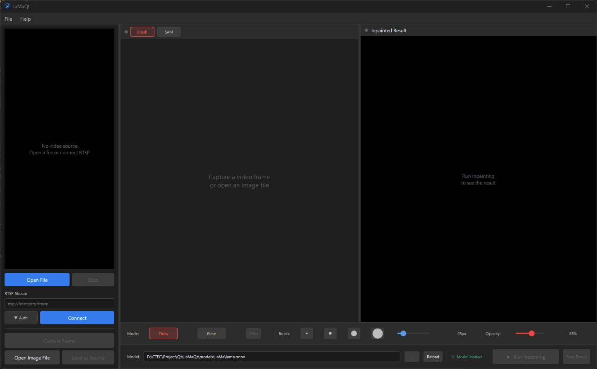

# LaMaQt

Qt6 / QML 기반 AI Image Inpainting Application.  
RTSP Stream, Video File, 정지 Image에서 Frame을 Capture하여 **SAM 2**(Segment Anything Model 2)로 Click 한 번에 Mask를 자동 생성하고 **LaMa**(Large Mask Inpainting) Model로 Object Instance를 제거 후 배경을 복구합니다.

---

## Demo





---

## Features

- **Brush Mode** — 직접 Mask를 그려 제거할 영역을 지정
- **SAM Mode** — Left Click(Positive) / Right Click(Negative) Point로 Object Instance를 자동 선택, SAM 2가 실시간으로 Mask 생성
- **LaMa Inpainting** — GPU 가속 ONNX Runtime(CUDA EP)으로 고품질 Object Instance 제거 및 배경 복구
- **실시간 RTSP Streaming** — ID / PW 인증 포함, IP Camera 직접 연결
- **Video File 재생** — MP4, AVI, MKV, MOV, WMV, FLV, TS, WEBM 지원
- **정지 Image 입력** — PNG, JPG, BMP, TIFF, WEBP (대용량 자동 Downscale)
- **결과 저장** — PNG / JPEG, Ctrl+S 단축 Key 지원
- **Dark Theme QML UI** — SplitView, FPS Overlay, 해상도 Badge

---

## Tech Stack

| 항목               | 내용                                             |
| ---------------- | ---------------------------------------------- |
| UI               | Qt 6.10+ / QML / Qt Quick Controls 2           |
| Language         | C++17                                          |
| Inpainting       | LaMa (ONNX Runtime 1.24+, CUDA EP)             |
| Segmentation     | SAM 2 — Tiny / Small / Base+ / Large           |
| GPU 가속           | CUDA 13.1 + cuDNN 9.17                         |
| Image Processing | OpenCV 4.14 (CUDA Modules)                     |
| Video Decode     | libVLC 3.0 (vmem API, D3D11VA Hardware Decode) |
| Build            | CMake 3.20+ / MSVC 2022                        |

---

## Hierarchy

```
RTSP / Video File / Image
         │
 VLCFrameGrabber (libvlc vmem)
 └─ I420 → RGB888 변환 (긴 변 기준 최대 1920px)
         │
    VideoPlayer → VideoSurface (QQuickPaintedItem, Letterbox)
         │
   QML SourcePanel
         │ frameCaptured(base64)
         ▼
   WorkspacePanel
   ├─ Brush Mode ──────────────────────────────────────────┐
   │   MaskPainter (QPainterPath, Brush Size / Opacity)   │
   │                                                       │
   └─ SAM Mode ────────────────────────────────────────────┤
       SegmentCanvas → SAMBridge → SAM2Engine (ONNX)       │
       Left-click(+) / Right-click(−) → Mask Preview       │
                                                           │
                              ┌────────────────────────────┘
                              ▼
                         LaMaBridge
                         QtConcurrent::run
                              │
                         LaMaEngine → LaMa (ONNX)
                         ├─ Preprocess  (GPU: BGR→RGB, Normalize, Pad)
                         ├─ Inference   (ONNX Runtime CUDA EP, 512×512)
                         └─ Postprocess (GPU: Composite, Crop)
                              │
                    ResultImageProvider (image://result/)
                              │
                         QML Image → 결과 표시
```

**주요 설계 결정**
- ONNX Runtime 선택 이유: TensorRT 10.x는 LaMa의 FFC Block에서 사용하는 ONNX DFT Operator를 지원하지 않음. ONNX Runtime CUDA EP는 DFT를 Native 지원하여 GPU 추론 가능
- SAM 2 Pipeline: `encodeImage()` 한 번으로 Image Embedding Caching → `decode()` 호출마다 재사용하여 빠른 반응 속도
- GPU Pre/Post-processing: OpenCV CUDA `GpuMat`을 ONNX Runtime I/O Buffer의 View로 사용 (D2D, Zero-copy)
- `LaMaBridge::inpaint` → `QtConcurrent::run` — 추론 중 UI Thread Blocking 없음

---

## Prerequisites

- **Qt 6.10+** (MSVC 2022 64-bit)
- **CMake 3.20+**
- **CUDA 13.1** + **cuDNN 9.17**
- **ONNX Runtime 1.24+** (GPU) — `C:/onnxruntime-win-x64-gpu-1.24.2`
- **OpenCV 4.14** (CUDA Modules 포함) — `C:/OpenCV_4.13.0`
- **libVLC 3.0** — `C:/libVLC`
- **LaMa ONNX Model** — `models/LaMa/lama.onnx`
- **SAM 2 ONNX Models** — `models/SAM_2/` (samexporter 형식)

### SAM 2 Model (samexporter)

```bash
pip install samexporter
python -m samexporter.export_sam2 \
    --checkpoint sam2_hiera_small.pt \
    --model-type sam2_hiera_small \
    --output models/SAM_2/small
```

---

## Build

```bash
cmake -B build -G Ninja -DCMAKE_BUILD_TYPE=Release ^
      -DCMAKE_PREFIX_PATH=C:/Qt/6.10.x/msvc2022_64
cmake --build build --config Release
```

CMake Post-build Step에서 ONNX Runtime / OpenCV / cuDNN / VLC DLL 복사 및 `windeployqt6` 실행이 자동으로 수행됩니다.

---

## Getting Started

1. **Open Source** (Left Panel)
   - `Open File` — Video 또는 Image File 선택
   - RTSP URL 입력 후 `Connect` — IP Camera 연결
   - `Capture` — 현재 Frame을 오른쪽 작업 영역으로 전송

1. **Load Model** (Right Panel)
   - `Model:` 우측 `...` 버튼 → LaMa ONNX File 선택 → `Load Model`
   - `SAM:` 우측 `...` 버튼 → SAM 2 Model Folder 선택 → Variant 선택 → `Load SAM`

3. **Brush Mode** (기본)
   - Mouse Drag로 제거할 영역에 Mask 직접 도색
   - Brush 크기 / 불투명도 Slider로 조절

1. **SAM Mode** (Tab 전환)
   - Left Click — Positive Point (객체 포함)
   - Right Click — Negative Point (객체 제외)
   - SAM 2가 실시간으로 Mask 생성 및 Preview 표시

5. **Run Inpainting** — LaMa가 Mask 영역을 자연스럽게 채워 객체 제거

6. **결과 저장** — `Save Result` Button 또는 `Ctrl+S`

---

## License

본 Project Source Code는 [MIT License](LICENSE)를 따릅니다.

사용된 Open Source Library:

| Library      | License            |
| ------------ | ------------------ |
| Qt           | LGPL v3            |
| libVLC       | LGPL v2.1          |
| ONNX Runtime | MIT                |
| OpenCV       | Apache License 2.0 |
| SAM2         | Apache License 2.0 |
| LaMa         | Apache License 2.0 |
